A Look into the Future: Forecasting Cases of AIDS
================
Vivian Tran
3/12/2018

Abstract
--------

My project addresses how to find a linear model to forecast the future values of a monthly time series. I accomplished this task by determining potential ARIMA models through the autocorrelation and partial autocorrelation functions of the stationary data. I also analyzed the AICc values. After testing potential models for independence, I began the forecasting process. I plotted the original time series but removed the 10 last data points. I used the forecast() function on each model to predict ten points ahead and plotted the prediction onto the time series. Through this method, I concluded that an ARIMA(9,3,12) model created the closest fit to the ten missing points.

Introduction
------------

My data set contains the monthly number of adults ages 30-34 who are diagnosed with AIDS in the United states from 1993 to 2002. By forecasting the future number of cases, medical suppliers and healthcare providers can plan their resources and better care for patients in the later years. I retrieved my data from CDC WONDER, CDC’s database for public-use health data. A full description of the dataset can be found on their [website](https://wonder.cdc.gov/wonder/help/aids.html). I used R to analyze the data.

### Packages Used

``` r
library(MASS)
library(qpcR)
library(forecast)
library(ggplot2)
```

``` r
#read data

AIDS <- read.csv("AIDS.csv", header= TRUE,sep=",")

AIDS_ts<-ts(AIDS$Cases, start=c(1993,1), freq=12)
```

Looking at the raw time series, we can see that there is a clear trend component in our data. The number of cases decreases gradually over the years, starting from 2000 cases around the year 1994 to around 500-800 cases in 2002. There is also non-constant variance, since the amplitude of the curves changes over time. However, there does not seem to be any strong seasonal component or sharp changes in the plot.

``` r
#plot data
ts.plot(AIDS_ts, main="Adults ages 30-34 diagnosed with AIDS in the US, 1993-2002, monthly", ylab="Number of cases", xlab="time")
```

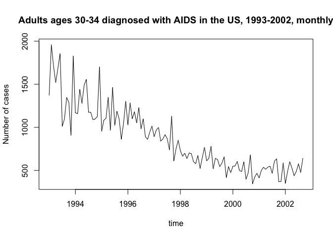 \#\# Creating a stationary time series Since there is non-constant variance, I decided to transform my data using a Box-Cox method: 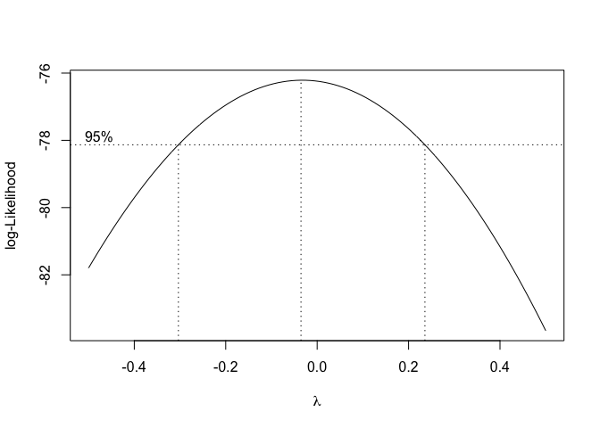 From the Box-Cox plot, I chose lambda to be 0, resulting in a log-transformation: 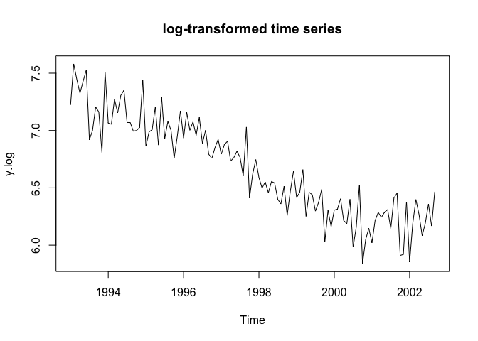

Removing trend component
------------------------

After log-transforming the data, I had constant variance. However, the data still had a trend component. To de-trend, I differenced my transformed data three times at lag=1. I chose to difference 3 times since the variance of the data kept going down until the third time I differenced. When I differenced 4 times, the variance went back up.

``` r
# differencing to remove trend
y.log.diff3 <- diff(y.log,3)
ts.plot(y.log.diff3,main = "Data Differenced 3 Times",ylab=expression(paste(nabla,y)))
```

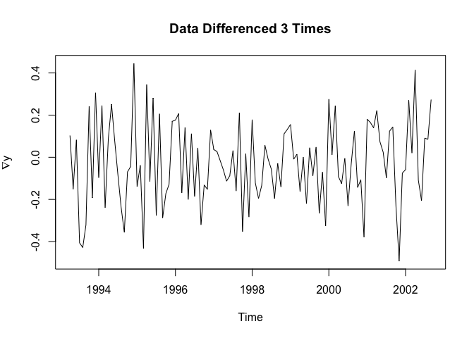

``` r
#differencing at lag1 3 times has lowest variance
```

The data is now stationary because there is no trend component, no seasonal component, and no apparent changes in behavior over time (constant variance), fulfilling all of the assumptions to begin modeling our data using autoregressive models, moving-average models, or a combination of the two.

Determining orders p and q in ARIMA(p,d,q)
------------------------------------------

Recall that d=3 because I differenced 3 times. To determine orders q and p, I looked at the autocorrelation and partial autocorrelation functions (ACF and PACF) of the data respectively.

Based on these plots, I chose p=9 because the PACF plot cuts off after lag 9, and q=12 because ACF cuts off after lag 12. I also decided to include q=10 because it is near the cut-off. 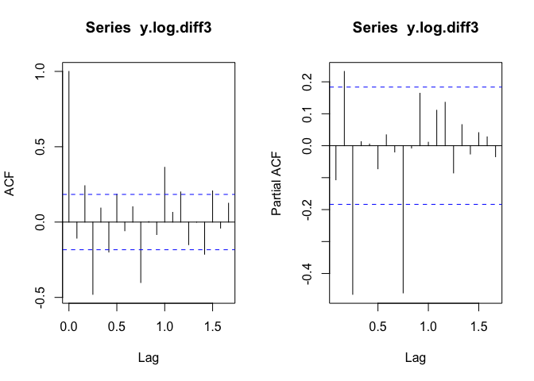

Computing the AICc values, we see that the suggested model was ARIMA(9,3,4) because it had the lowest AIC(C) value:

    ##     q
    ## p             0          1          2          3          4          5
    ##   0   -45.26117  -44.13300  -49.20528  -98.17205  -97.02301  -98.24525
    ##   1   -44.51876  -58.12204  -86.42122  -97.74570 -100.45116  -98.17965
    ##   2   -48.81665  -61.17443  -90.04957  -99.02602  -96.90065  -96.19086
    ##   3   -74.87107  -72.72797  -70.52182  -96.81354  -94.47301  -94.63523
    ##   4   -72.72975  -70.50051  -91.92119  -94.77582  -94.71976  -98.80855
    ##   5   -70.50369  -68.22881  -81.04330  -92.93250  -94.70753  -96.76475
    ##   6   -69.07522  -66.83608  -90.92387  -90.97813  -88.53458  -95.27095
    ##   7   -66.93241  -64.57819  -83.60420  -88.56724  -86.08579  -93.86304
    ##   8   -64.72652  -71.19911  -96.18601  -86.77014  -98.28442  -93.05992
    ##   9  -105.95888 -103.57372 -103.83999 -107.78245 -115.12486 -112.49422
    ##   10 -103.62112 -102.93389 -109.03763 -108.45496 -113.21813 -109.76424
    ##     q
    ## p             6          7          8          9         10         11
    ##   0   -95.97585  -95.00469  -94.60843  -95.77398  -96.86195  -97.37413
    ##   1   -93.66192  -92.78347  -93.48173  -93.56059  -95.32118  -99.41840
    ##   2   -94.75303 -102.07764  -96.78960 -103.25862  -97.39758  -97.96232
    ##   3  -102.05958  -99.65943  -97.20928 -101.13086  -98.84381 -100.59925
    ##   4   -94.64313  -97.44794  -95.02486  -98.75350  -97.59833  -98.54881
    ##   5   -94.27261  -93.23994  -93.98237  -92.44347  -96.78693  -96.56560
    ##   6   -97.71835  -92.29330  -97.58880  -93.67505  -95.32422  -95.15804
    ##   7   -92.79064  -90.81093  -99.44669  -90.84134  -96.50648  -97.65932
    ##   8   -92.08319  -92.18627 -103.41549  -99.30991  -92.62578  -92.86949
    ##   9  -111.35722 -110.30131 -107.63040 -105.69607 -104.03337 -102.92212
    ##   10 -109.56074 -107.50499 -104.68475 -102.94884 -100.11352  -99.96113
    ##     q
    ## p            12
    ##   0  -103.50696
    ##   1  -101.14378
    ##   2   -98.49308
    ##   3  -101.15244
    ##   4   -95.22089
    ##   5  -101.34034
    ##   6   -97.79322
    ##   7   -94.85595
    ##   8   -99.02252
    ##   9  -100.87824
    ##   10  -98.19247

Models and coefficients
-----------------------

To summarize, the potential models were ARIMA(9,3,4), ARIMA(9,3,10), ARIMA(9,3,12).

### Coefficients for ARIMA(9,3,4)

``` r
fit1
```

    ## 
    ## Call:
    ## arima(x = y.log.diff3, order = c(9, 3, 4), method = "ML")
    ## 
    ## Coefficients:
    ##           ar1      ar2      ar3      ar4      ar5      ar6      ar7
    ##       -1.6026  -1.6294  -1.5331  -1.2930  -1.0476  -0.7993  -0.3455
    ## s.e.   0.0984   0.1880   0.2483   0.2838   0.2957   0.2859   0.2554
    ##          ar8     ar9      ma1      ma2      ma3     ma4
    ##       0.1316  0.0648  -0.9587  -0.0733  -0.9587  1.0000
    ## s.e.  0.1971  0.1053   0.0517   0.0416   0.0860  0.0676
    ## 
    ## sigma^2 estimated as 0.02125:  log likelihood = 41.35,  aic = -54.71

### Coefficients for ARIMA(9,3,10)

``` r
fit2
```

    ## 
    ## Call:
    ## arima(x = y.log.diff3, order = c(9, 3, 10), method = "ML")
    ## 
    ## Coefficients:

    ## Warning in sqrt(diag(x$var.coef)): NaNs produced

    ##           ar1      ar2      ar3     ar4     ar5      ar6     ar7     ar8
    ##       -0.7650  -0.3291  -0.3175  0.1795  0.1020  -0.1336  0.0769  0.1861
    ## s.e.   0.1954   0.1938      NaN  0.1553  0.1413   0.1641  0.1964  0.1495
    ##           ar9      ma1     ma2      ma3     ma4      ma5      ma6     ma7
    ##       -0.1146  -1.9193  0.8356  -0.8011  1.3540  -0.0620  -0.3721  0.4405
    ## s.e.   0.1131   0.1525  0.3674   0.3674  0.1781   0.4545   0.2293  0.3538
    ##           ma8     ma9    ma10
    ##       -0.8922  0.3514  0.0657
    ## s.e.   0.3590     NaN     NaN
    ## 
    ## sigma^2 estimated as 0.01843:  log likelihood = 47.81,  aic = -55.62

### Coefficients for ARIMA(9,3,12)

``` r
fit3
```

    ## 
    ## Call:
    ## arima(x = y.log.diff3, order = c(9, 3, 12), method = "ML")
    ## 
    ## Coefficients:

    ## Warning in sqrt(diag(x$var.coef)): NaNs produced

    ##           ar1      ar2      ar3      ar4      ar5      ar6     ar7     ar8
    ##       -1.3845  -1.2976  -1.6356  -1.2685  -1.0397  -0.7891  0.0031  0.3462
    ## s.e.      NaN      NaN      NaN      NaN      NaN      NaN     NaN  0.4382
    ##          ar9      ma1     ma2      ma3     ma4     ma5      ma6     ma7
    ##       0.0956  -1.4021  0.3699  -0.4667  0.3423  0.2777  -0.8754  0.9266
    ## s.e.  0.1640      NaN     NaN   0.9555  0.3471  0.9686   0.8964     NaN
    ##           ma8     ma9    ma10     ma11    ma12
    ##       -0.0574  0.2760  0.0593  -0.7391  0.2888
    ## s.e.      NaN  0.7273  0.3270   0.8854  0.4425
    ## 
    ## sigma^2 estimated as 0.01563:  log likelihood = 53.07,  aic = -62.13

Residual Diagnostics
--------------------

### ARIMA(9,3,4)

#### Test for Independence

Model residuals passed ljung and Box-Pierce tests for independence; data is randomly distributed

``` r
# Test for independence of residuals
Box.test(residuals(fit1), type="Ljung")
```

    ## 
    ##  Box-Ljung test
    ## 
    ## data:  residuals(fit1)
    ## X-squared = 4.1158e-09, df = 1, p-value = 0.9999

``` r
Box.test(residuals(fit1), type="Box-Pierce")
```

    ## 
    ##  Box-Pierce test
    ## 
    ## data:  residuals(fit1)
    ## X-squared = 4.0093e-09, df = 1, p-value = 0.9999

#### Tests for Normality

Model residuals passed test Shapiro test for normality; data is normally distributed

``` r
#test normality of residuals
shapiro.test(residuals(fit1))
```

    ## 
    ##  Shapiro-Wilk normality test
    ## 
    ## data:  residuals(fit1)
    ## W = 0.98701, p-value = 0.3436

``` r
ts.plot(residuals(fit1),main = "Fitted Residuals")
```

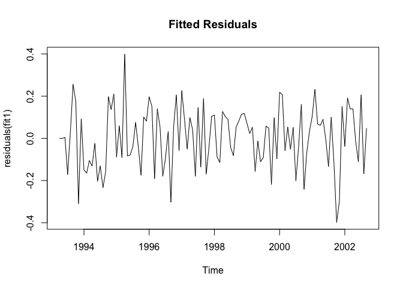

``` r
par(mfrow=c(1,2),oma=c(0,0,2,0))
# Plot diagnostics of residuals
op <- par(mfrow=c(2,2))
# acf
acf(residuals(fit1),main = "Autocorrelation")
acf((residuals(fit1))^2,main = "Autocorrelation") #show dependence/correlation between squartes;typical; use non-linear models 

# pacf
pacf(residuals(fit1),main = "Partial Autocorrelation")

# Histogram
hist(residuals(fit1),main = "Histogram")
```

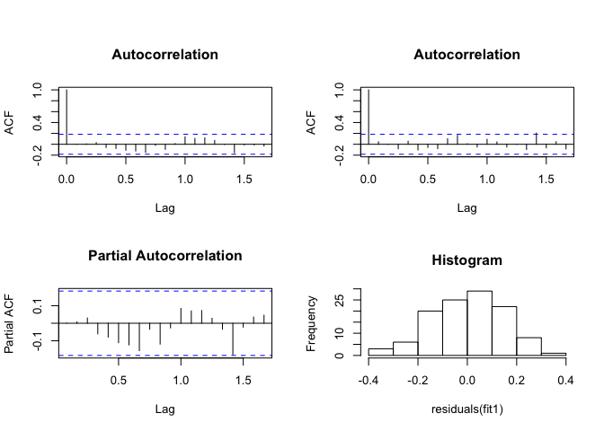

``` r
# q-q plot
qqnorm(residuals(fit1))
qqline(residuals(fit1),col ="blue")
# Add overall title
title("Fitted Residuals Diagnostics", outer=TRUE)
par(op)
```

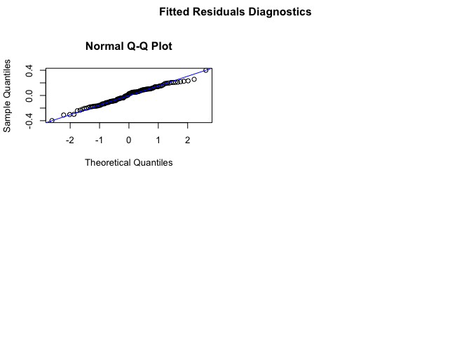

### ARIMA(9,3,10)

#### Test for Independence

Model residuals passed ljung and Box-Pierce tests for independence; data is randomly distributed

    ## 
    ##  Box-Ljung test
    ## 
    ## data:  residuals(fit2)
    ## X-squared = 0.081005, df = 1, p-value = 0.7759

    ## 
    ##  Box-Pierce test
    ## 
    ## data:  residuals(fit2)
    ## X-squared = 0.07891, df = 1, p-value = 0.7788

#### Tests for Normality

Model residuals passed test Shapiro test for normality; data is normally distributed

    ## 
    ##  Shapiro-Wilk normality test
    ## 
    ## data:  residuals(fit2)
    ## W = 0.98743, p-value = 0.3714

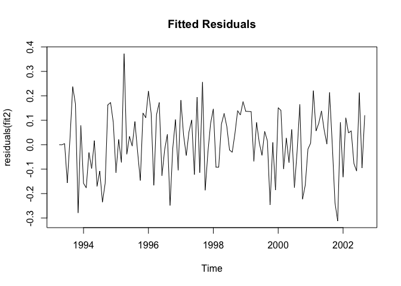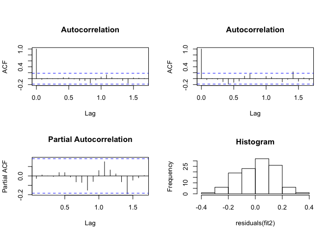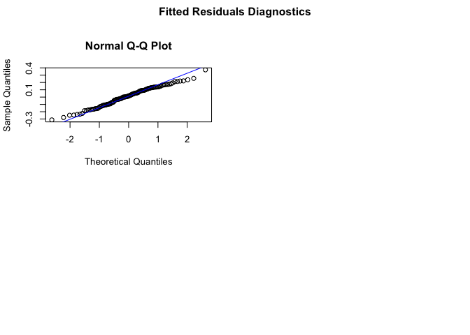

### ARIMA(9,3,12)

#### Test for Independence

Model residuals passed ljung and Box-Pierce tests for independence; data is randomly distributed

    ## 
    ##  Box-Ljung test
    ## 
    ## data:  residuals(fit3)
    ## X-squared = 0.0059557, df = 1, p-value = 0.9385

    ## 
    ##  Box-Pierce test
    ## 
    ## data:  residuals(fit3)
    ## X-squared = 0.0058017, df = 1, p-value = 0.9393

#### Tests for Normality

Model residuals passed test Shapiro test for normality; data is normally distributed

    ## 
    ##  Shapiro-Wilk normality test
    ## 
    ## data:  residuals(fit3)
    ## W = 0.99343, p-value = 0.869

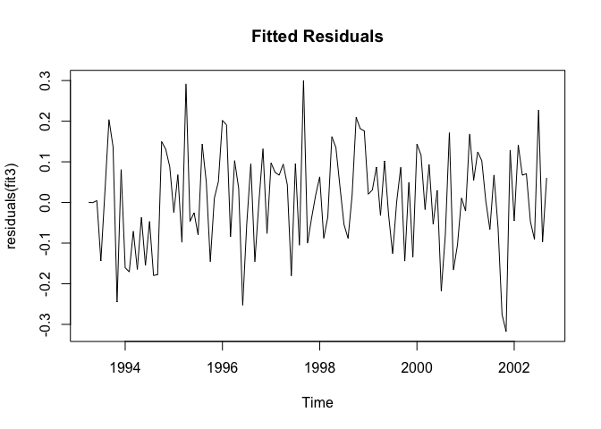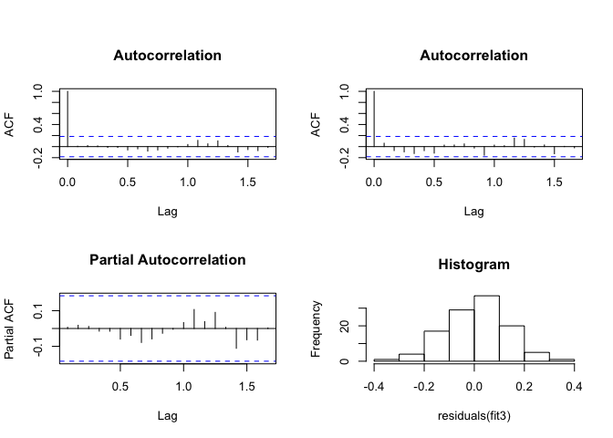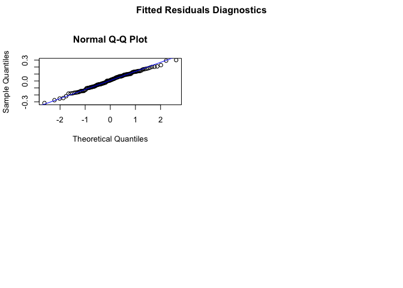

``` r
#setwd("C:/Users/Vivian/Documents/PSTAT174_project")
#data forecasting 
AIDS_ts_mod<-ts(AIDS$Cases, start=c(1993,1), freq=12, end=c(2002,4))
```

``` r
#install.packages("forecast")

#plot data with 5 less points
mod <- window(AIDS_ts_mod)

# fit modified data using our models
fit1_AIDS = arima(mod, order=c(9,3,4),method="ML")
fit2_AIDS = arima(mod, order=c(9,3,10),method="ML")
fit3_AIDS = arima(mod, order=c(9,3,12),method="ML")


# use models to forecast 5 values ahead
fcast1_AIDS <- forecast(fit1_AIDS, h=5)
fcast2_AIDS <- forecast(fit2_AIDS, h=5)
fcast3_AIDS <- forecast(fit3_AIDS, h=5)

plot(fcast1_AIDS, xlab = "year", ylab="Number of cases")
```

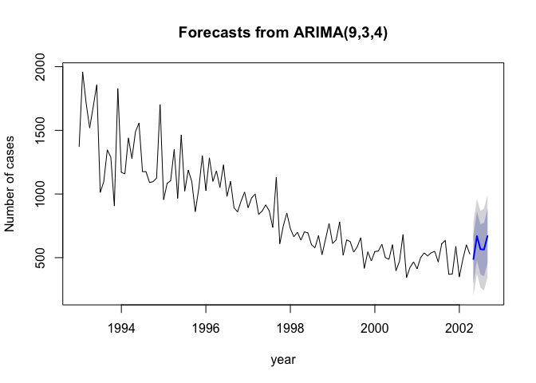

``` r
plot(fcast2_AIDS, xlab = "year", ylab="Number of cases")
```

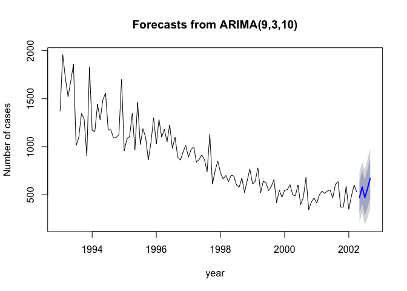

``` r
plot(fcast3_AIDS, xlab = "year", ylab="Number of cases", col="seagreen")
```

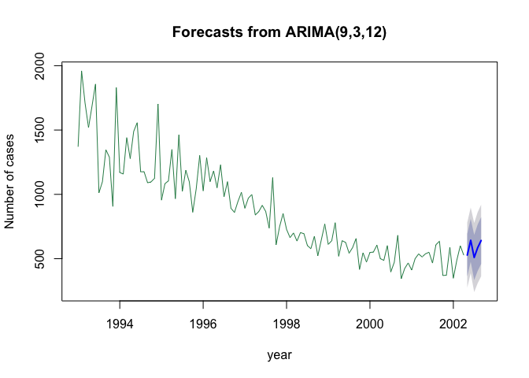

``` r
# compare our model fits visually
ts.plot(AIDS_ts_mod, main="Fitted using ARIMA(9,3,4)", ylab="Number of cases", xlab="year")
lines(fitted(fcast1_AIDS), col="goldenrod")
```

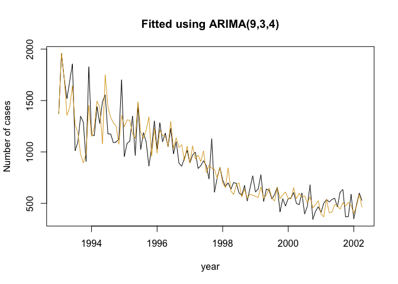

``` r
ts.plot(AIDS_ts_mod, main="Fitted using ARIMA(9,3,10)", ylab="Number of cases", xlab="year")
lines(fitted(fcast2_AIDS), col="skyblue")
```

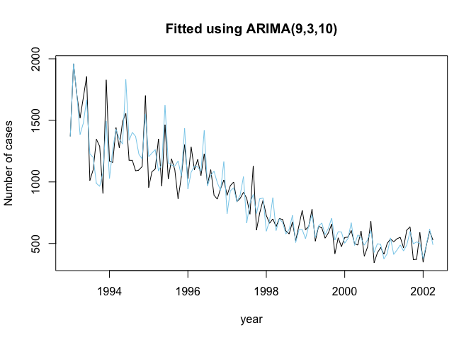

``` r
ts.plot(AIDS_ts_mod, main="Fitted using ARIMA(9,3,12)", ylab="Number of cases", xlab="year")
lines(fitted(fcast3_AIDS), col="seagreen") # this one seems to be the best
```

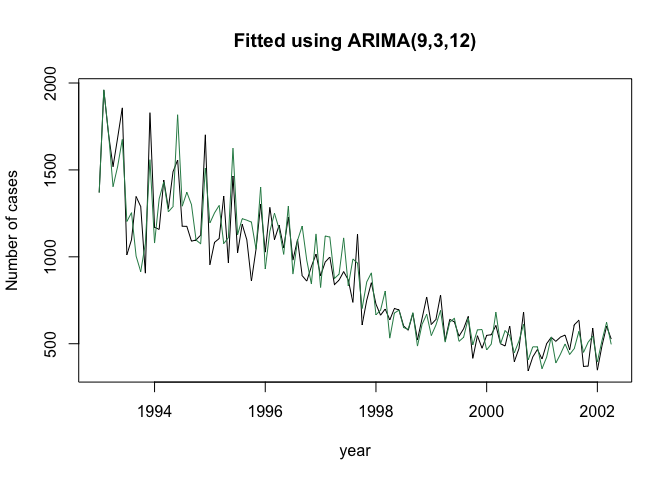

``` r
# compare the forecasted values with the 5 values that we removed 

AIDS <- read.csv("AIDS.csv", header= TRUE,sep=",")
AIDS_ts_orig<-ts(AIDS$Cases, start=c(1993,1), freq=12) # original data

plot(fcast1_AIDS, xlab = "year", ylab="Number of cases")
lines(AIDS_ts_orig)
```

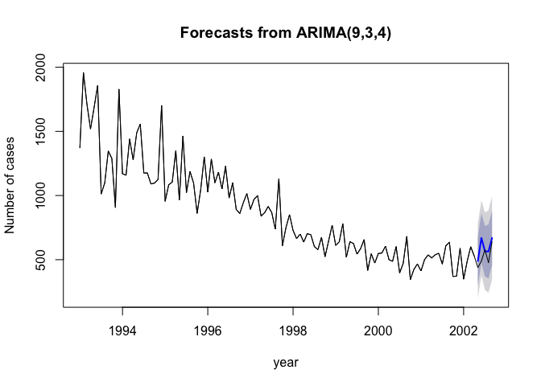

``` r
plot(fcast2_AIDS, xlab = "year", ylab="Number of cases") # this one seems to do better overall
lines(AIDS_ts_orig)
```

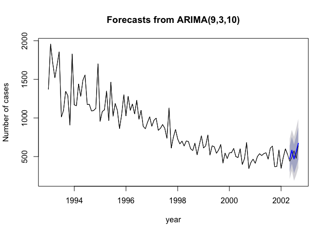

``` r
plot(fcast3_AIDS, xlab = "year", ylab="Number of cases")
lines(AIDS_ts_orig)
```

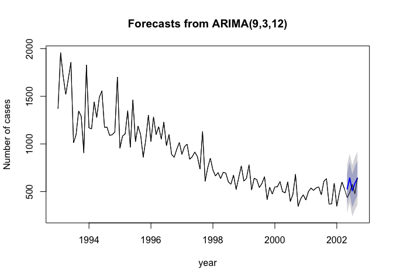
