PSTAT 174
================
Vivian Tran
3/12/2018

Abstract
--------

My project addresses how to find a linear model to forecast the future values of a monthly time series. I accomplished this task by determining potential ARIMA models through the autocorrelation and partial autocorrelation functions of the stationary data. I also analyzed the AICc values. After testing potential models for independence, I began the forecasting process. I plotted the original time series but removed the 10 last data points. I used the forecast() function on each model to predict ten points ahead and plotted the prediction onto the time series. Through this method, I concluded that an ARIMA(9,3,12) model created the closest fit to the ten missing points.

Introduction
------------

My data set contains the monthly number of adults ages 30-34 who are diagnosed with AIDS in the United states from 1993 to 2002. By forecasting the future number of cases, medical suppliers and healthcare providers can plan their resources and better care for patients in the later years. I retrieved my data from CDC WONDER, CDC’s database for public-use health data. A full description of the dataset can be found on their [website](https://wonder.cdc.gov/wonder/help/aids.html). I used R to analyze the data.

### Packages Used

``` r
library(MASS)
```

    ## Warning: package 'MASS' was built under R version 3.4.3

``` r
library(qpcR)
```

    ## Loading required package: minpack.lm

    ## Loading required package: rgl

    ## Warning: package 'rgl' was built under R version 3.4.3

    ## Loading required package: robustbase

    ## Loading required package: Matrix

``` r
library(forecast)
```

    ## Warning in as.POSIXlt.POSIXct(Sys.time()): unknown timezone 'zone/tz/2018c.
    ## 1.0/zoneinfo/America/Los_Angeles'

``` r
library(ggplot2)
```

``` r
#read data

AIDS <- read.csv("AIDS.csv", header= TRUE,sep=",")

AIDS_ts<-ts(AIDS$Cases, start=c(1993,1), freq=12)
```

``` r
#plot data
ts.plot(AIDS_ts, main="Adults ages 30-34 diagnosed with AIDS in the US, 1993-2002, monthly", ylab="Number of cases", xlab="time")
```

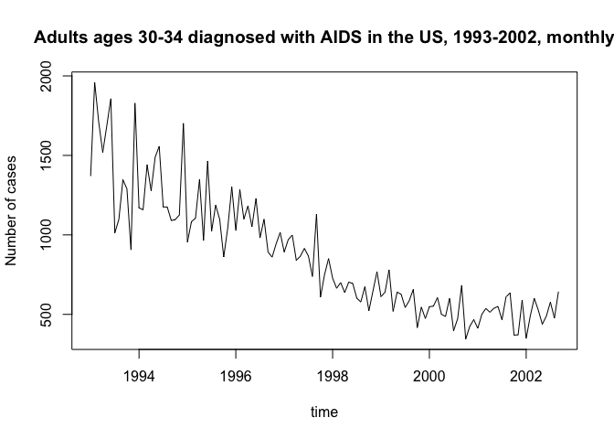

``` r
#boxcox
bcTrans <- boxcox(AIDS_ts ~ as.numeric(1:length(AIDS_ts)))
```

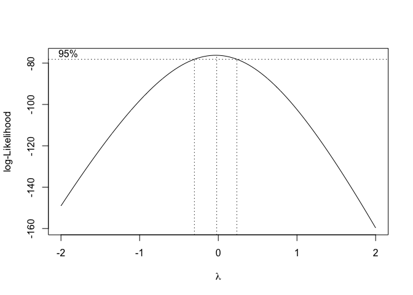

``` r
bcTrans2 <- boxcox(AIDS_ts ~ as.numeric(1:length(AIDS_ts)), lambda=seq(-.5,.5, len=100))
```

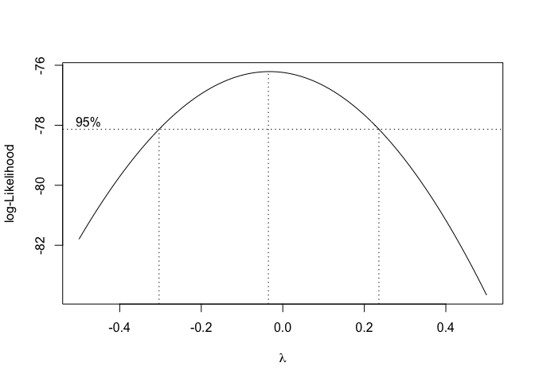

``` r
#choose lambda=0, so log transform
y.log <- log(AIDS_ts) 

#plot transformation

ts.plot(y.log,main = "Log")
```

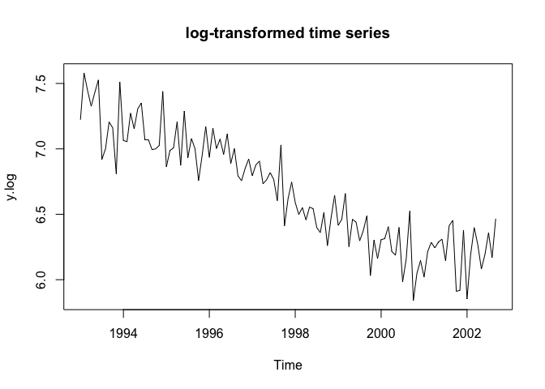

``` r
# differencing to remove trend
y.log.diff3 <- diff(y.log,3)
ts.plot(y.log.diff3,main = "Differenced Data 3 times",ylab=expression(paste(nabla,y)))
```

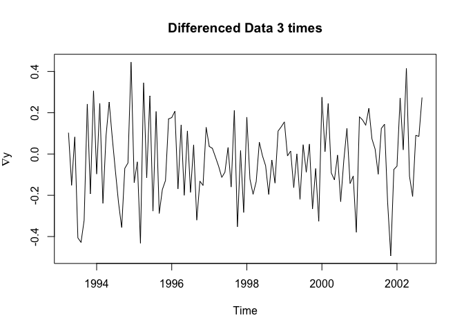

``` r
#differencing at lag1 3 times has lowest variance
```

``` r
#acf, pacf

op <- par(mfrow = c(1,2))
acf(y.log.diff3)
pacf(y.log.diff3)
```

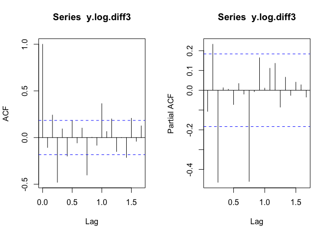

``` r
par(op)
```

``` r
# Calculate AICc for ARMA models with p and q 
#suggested model: ARIMA(9,3,4)

aiccs <- matrix(NA, nr = 11, nc = 13)
dimnames(aiccs) = list(p=0:10, q=0:12)
for(p in 0:10)
{
  for(q in 0:12)
  {
    aiccs[p+1,q+1] = AICc(arima(y.log.diff3, order = c(p,0,q), method="ML"))
  }
}
aiccs
```

    ##     q
    ## p             0          1          2          3          4          5
    ##   0   -45.26117  -44.13300  -49.20528  -98.17205  -97.02301  -98.24525
    ##   1   -44.51876  -58.12204  -86.42122  -97.74570 -100.45116  -98.17965
    ##   2   -48.81665  -61.17443  -90.04957  -99.02602  -96.90065  -96.19086
    ##   3   -74.87107  -72.72797  -70.52182  -96.81354  -94.47301  -94.63523
    ##   4   -72.72975  -70.50051  -91.92119  -94.77582  -94.71976  -98.80855
    ##   5   -70.50369  -68.22881  -81.04330  -92.93250  -94.70753  -96.76475
    ##   6   -69.07522  -66.83608  -90.92387  -90.97813  -88.53458  -95.27095
    ##   7   -66.93241  -64.57819  -83.60420  -88.56724  -86.08579  -93.86304
    ##   8   -64.72652  -71.19911  -96.18601  -86.77014  -98.28442  -93.05992
    ##   9  -105.95888 -103.57372 -103.83999 -107.78245 -115.12486 -112.49422
    ##   10 -103.62112 -102.93389 -109.03763 -108.45496 -113.21813 -109.76424
    ##     q
    ## p             6          7          8          9         10         11
    ##   0   -95.97585  -95.00469  -94.60843  -95.77398  -96.86195  -97.37413
    ##   1   -93.66192  -92.78347  -93.48173  -93.56059  -95.32118  -99.41840
    ##   2   -94.75303 -102.07764  -96.78960 -103.25862  -97.39758  -97.96232
    ##   3  -102.05958  -99.65943  -97.20928 -101.13086  -98.84381 -100.59925
    ##   4   -94.64313  -97.44794  -95.02486  -98.75350  -97.59833  -98.54881
    ##   5   -94.27261  -93.23994  -93.98237  -92.44347  -96.78693  -96.56560
    ##   6   -97.71835  -92.29330  -97.58880  -93.67505  -95.32422  -95.15804
    ##   7   -92.79064  -90.81093  -99.44669  -90.84134  -96.50648  -97.65932
    ##   8   -92.08319  -92.18627 -103.41549  -99.30991  -92.62578  -92.86949
    ##   9  -111.35722 -110.30131 -107.63040 -105.69607 -104.03337 -102.92212
    ##   10 -109.56074 -107.50499 -104.68475 -102.94884 -100.11352  -99.96113
    ##     q
    ## p            12
    ##   0  -103.50696
    ##   1  -101.14378
    ##   2   -98.49308
    ##   3  -101.15244
    ##   4   -95.22089
    ##   5  -101.34034
    ##   6   -97.79322
    ##   7   -94.85595
    ##   8   -99.02252
    ##   9  -100.87824
    ##   10  -98.19247

``` r
#coefficients of potential models
fit1 = arima(y.log.diff3, order=c(9,3,4),method="ML") #lowest AICc
fit2 = arima(y.log.diff3, order=c(9,3,10),method="ML") #check just in case
fit3 = arima(y.log.diff3, order=c(9,3,12),method="ML") #suggested model by ACF/PACF

fit1
```

    ## 
    ## Call:
    ## arima(x = y.log.diff3, order = c(9, 3, 4), method = "ML")
    ## 
    ## Coefficients:
    ##           ar1      ar2      ar3      ar4      ar5      ar6      ar7
    ##       -1.6026  -1.6294  -1.5331  -1.2930  -1.0476  -0.7993  -0.3455
    ## s.e.   0.0984   0.1880   0.2483   0.2838   0.2957   0.2859   0.2554
    ##          ar8     ar9      ma1      ma2      ma3     ma4
    ##       0.1316  0.0648  -0.9587  -0.0733  -0.9587  1.0000
    ## s.e.  0.1971  0.1053   0.0517   0.0416   0.0860  0.0676
    ## 
    ## sigma^2 estimated as 0.02125:  log likelihood = 41.35,  aic = -54.71

``` r
fit2
```

    ## 
    ## Call:
    ## arima(x = y.log.diff3, order = c(9, 3, 10), method = "ML")
    ## 
    ## Coefficients:
    ##           ar1      ar2      ar3     ar4     ar5      ar6     ar7     ar8
    ##       -0.7650  -0.3291  -0.3175  0.1795  0.1020  -0.1336  0.0769  0.1861
    ## s.e.   0.1954   0.1938      NaN  0.1553  0.1413   0.1641  0.1964  0.1495
    ##           ar9      ma1     ma2      ma3     ma4      ma5      ma6     ma7
    ##       -0.1146  -1.9193  0.8356  -0.8011  1.3540  -0.0620  -0.3721  0.4405
    ## s.e.   0.1131   0.1525  0.3674   0.3674  0.1781   0.4545   0.2293  0.3538
    ##           ma8     ma9    ma10
    ##       -0.8922  0.3514  0.0657
    ## s.e.   0.3590     NaN     NaN
    ## 
    ## sigma^2 estimated as 0.01843:  log likelihood = 47.81,  aic = -55.62

``` r
fit3
```

    ## 
    ## Call:
    ## arima(x = y.log.diff3, order = c(9, 3, 12), method = "ML")
    ## 
    ## Coefficients:
    ##           ar1      ar2      ar3      ar4      ar5      ar6     ar7     ar8
    ##       -1.3845  -1.2976  -1.6356  -1.2685  -1.0397  -0.7891  0.0031  0.3462
    ## s.e.      NaN      NaN      NaN      NaN      NaN      NaN     NaN  0.4382
    ##          ar9      ma1     ma2      ma3     ma4     ma5      ma6     ma7
    ##       0.0956  -1.4021  0.3699  -0.4667  0.3423  0.2777  -0.8754  0.9266
    ## s.e.  0.1640      NaN     NaN   0.9555  0.3471  0.9686   0.8964     NaN
    ##           ma8     ma9    ma10     ma11    ma12
    ##       -0.0574  0.2760  0.0593  -0.7391  0.2888
    ## s.e.      NaN  0.7273  0.3270   0.8854  0.4425
    ## 
    ## sigma^2 estimated as 0.01563:  log likelihood = 53.07,  aic = -62.13

#### ARIMA(9,3,4)

``` r
# Test for independence of residuals
Box.test(residuals(fit1), type="Ljung")
```

    ## 
    ##  Box-Ljung test
    ## 
    ## data:  residuals(fit1)
    ## X-squared = 4.1158e-09, df = 1, p-value = 0.9999

``` r
Box.test(residuals(fit1), type="Box-Pierce")
```

    ## 
    ##  Box-Pierce test
    ## 
    ## data:  residuals(fit1)
    ## X-squared = 4.0093e-09, df = 1, p-value = 0.9999

``` r
#test normality of residuals
shapiro.test(residuals(fit1))
```

    ## 
    ##  Shapiro-Wilk normality test
    ## 
    ## data:  residuals(fit1)
    ## W = 0.98701, p-value = 0.3436

``` r
ts.plot(residuals(fit1),main = "Fitted Residuals")
```

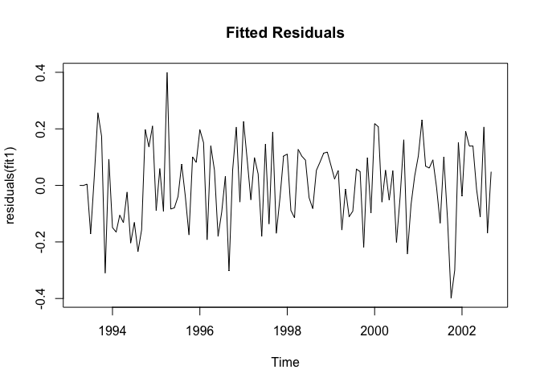

``` r
par(mfrow=c(1,2),oma=c(0,0,2,0))
# Plot diagnostics of residuals
op <- par(mfrow=c(2,2))
# acf
acf(residuals(fit1),main = "Autocorrelation")
acf((residuals(fit1))^2,main = "Autocorrelation") #show dependence/correlation between squartes;typical; use non-linear models 

# pacf
pacf(residuals(fit1),main = "Partial Autocorrelation")

# Histogram
hist(residuals(fit1),main = "Histogram")
```

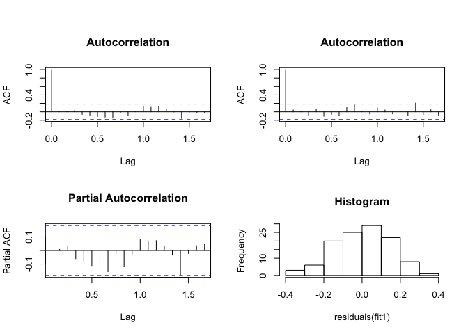

``` r
# q-q plot
qqnorm(residuals(fit1))
qqline(residuals(fit1),col ="blue")
# Add overall title
title("Fitted Residuals Diagnostics", outer=TRUE)
par(op)
```

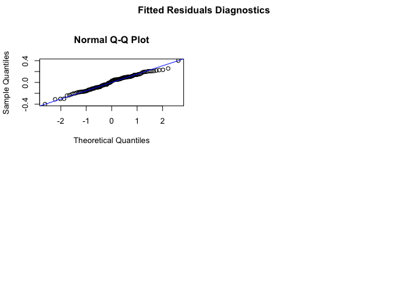

#### ARIMA(9,3,10)

``` r
# Test for independence of residuals
Box.test(residuals(fit2), type="Ljung")
```

    ## 
    ##  Box-Ljung test
    ## 
    ## data:  residuals(fit2)
    ## X-squared = 0.081005, df = 1, p-value = 0.7759

``` r
Box.test(residuals(fit2), type="Box-Pierce")
```

    ## 
    ##  Box-Pierce test
    ## 
    ## data:  residuals(fit2)
    ## X-squared = 0.07891, df = 1, p-value = 0.7788

``` r
#test normality of residuals
shapiro.test(residuals(fit2))
```

    ## 
    ##  Shapiro-Wilk normality test
    ## 
    ## data:  residuals(fit2)
    ## W = 0.98743, p-value = 0.3714

``` r
ts.plot(residuals(fit2),main = "Fitted Residuals")
```

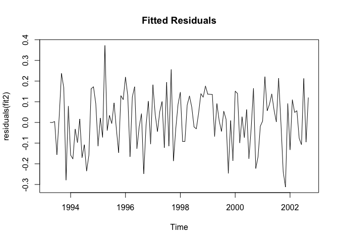

``` r
par(mfrow=c(1,2),oma=c(0,0,2,0))
# Plot diagnostics of residuals
op <- par(mfrow=c(2,2))
# acf
acf(residuals(fit2),main = "Autocorrelation")
acf((residuals(fit2))^2,main = "Autocorrelation") #show dependence/correlation between squartes;typical; use non-linear models 

# pacf
pacf(residuals(fit2),main = "Partial Autocorrelation")

# Histogram
hist(residuals(fit2),main = "Histogram")
```

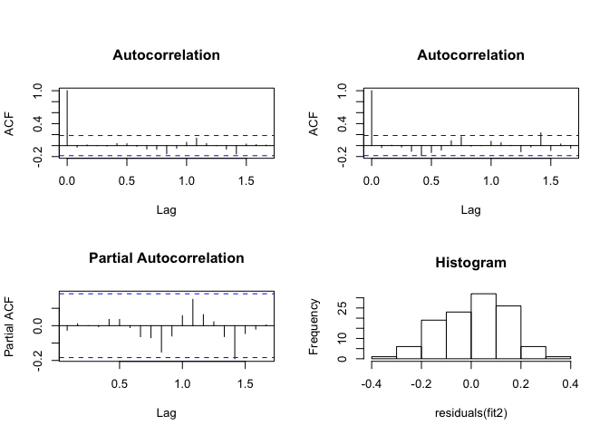

``` r
# q-q plot
qqnorm(residuals(fit2))
qqline(residuals(fit2),col ="blue")
# Add overall title
title("Fitted Residuals Diagnostics", outer=TRUE)
par(op)
```

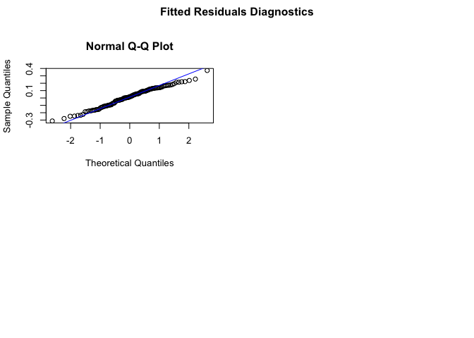

#### ARIMA(9,3,12)

``` r
# Test for independence of residuals
Box.test(residuals(fit3), type="Ljung")
```

    ## 
    ##  Box-Ljung test
    ## 
    ## data:  residuals(fit3)
    ## X-squared = 0.0059557, df = 1, p-value = 0.9385

``` r
Box.test(residuals(fit3), type="Box-Pierce")
```

    ## 
    ##  Box-Pierce test
    ## 
    ## data:  residuals(fit3)
    ## X-squared = 0.0058017, df = 1, p-value = 0.9393

``` r
#test normality of residuals
shapiro.test(residuals(fit3))
```

    ## 
    ##  Shapiro-Wilk normality test
    ## 
    ## data:  residuals(fit3)
    ## W = 0.99343, p-value = 0.869

``` r
ts.plot(residuals(fit3),main = "Fitted Residuals")
```

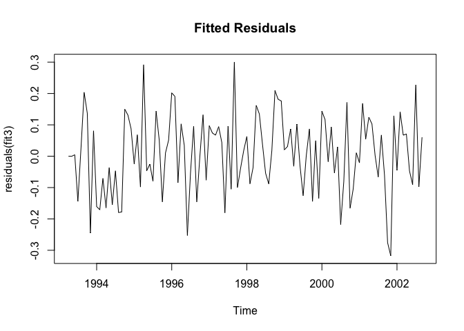

``` r
par(mfrow=c(1,2),oma=c(0,0,2,0))
# Plot diagnostics of residuals
op <- par(mfrow=c(2,2))
# acf
acf(residuals(fit3),main = "Autocorrelation")
acf((residuals(fit3))^2,main = "Autocorrelation") #show dependence/correlation between squartes;typical; use non-linear models 

# pacf
pacf(residuals(fit3),main = "Partial Autocorrelation")

# Histogram
hist(residuals(fit3),main = "Histogram")
```

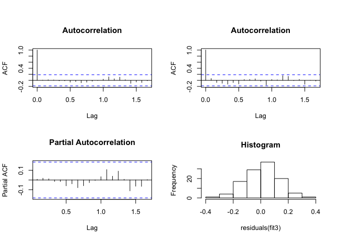

``` r
# q-q plot
qqnorm(residuals(fit3))
qqline(residuals(fit3),col ="blue")
# Add overall title
title("Fitted Residuals Diagnostics", outer=TRUE)
par(op)
```

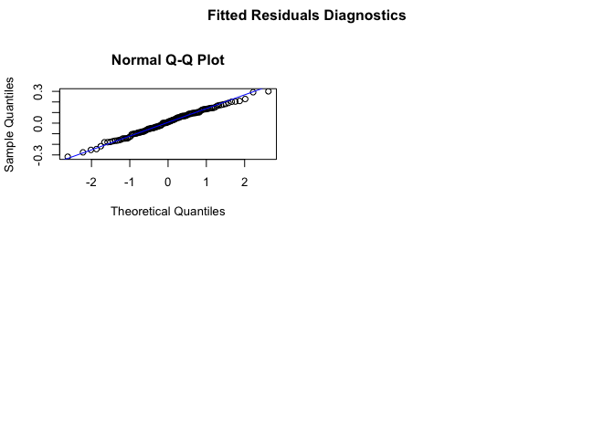

``` r
#setwd("C:/Users/Vivian/Documents/PSTAT174_project")
#data forecasting 
AIDS_ts_mod<-ts(AIDS$Cases, start=c(1993,1), freq=12, end=c(2002,4))
```

``` r
#install.packages("forecast")

#plot data with 5 less points
mod <- window(AIDS_ts_mod)

# fit modified data using our models
fit1_AIDS = arima(mod, order=c(9,3,4),method="ML")
fit2_AIDS = arima(mod, order=c(9,3,10),method="ML")
fit3_AIDS = arima(mod, order=c(9,3,12),method="ML")


# use models to forecast 5 values ahead
fcast1_AIDS <- forecast(fit1_AIDS, h=5)
fcast2_AIDS <- forecast(fit2_AIDS, h=5)
fcast3_AIDS <- forecast(fit3_AIDS, h=5)

plot(fcast1_AIDS, xlab = "year", ylab="Number of cases")
```

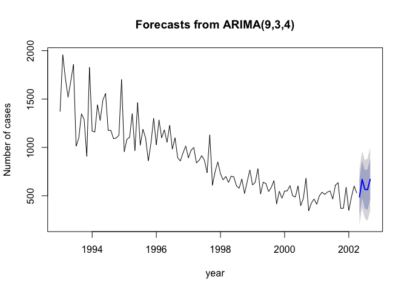

``` r
plot(fcast2_AIDS, xlab = "year", ylab="Number of cases")
```

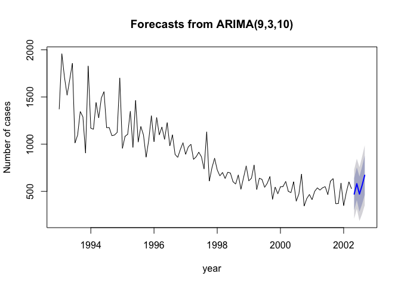

``` r
plot(fcast3_AIDS, xlab = "year", ylab="Number of cases", col="seagreen")
```

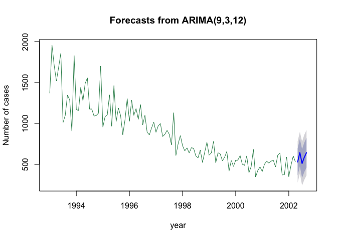

``` r
# compare our model fits visually
ts.plot(AIDS_ts_mod, main="Fitted using ARIMA(9,3,4)", ylab="Number of cases", xlab="year")
lines(fitted(fcast1_AIDS), col="goldenrod")
```

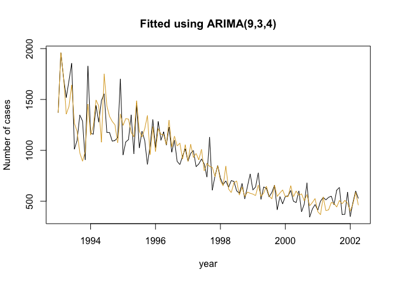

``` r
ts.plot(AIDS_ts_mod, main="Fitted using ARIMA(9,3,10)", ylab="Number of cases", xlab="year")
lines(fitted(fcast2_AIDS), col="skyblue")
```

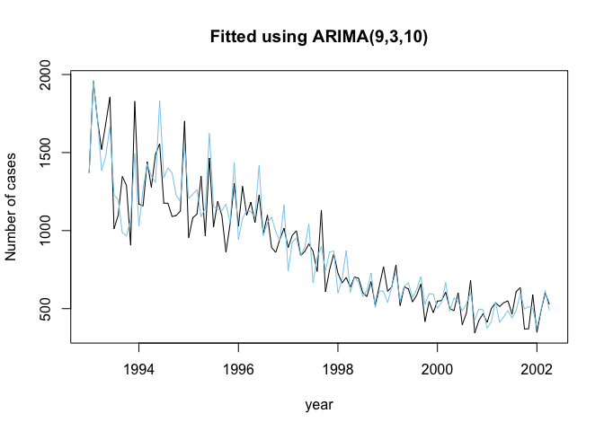

``` r
ts.plot(AIDS_ts_mod, main="Fitted using ARIMA(9,3,12)", ylab="Number of cases", xlab="year")
lines(fitted(fcast3_AIDS), col="seagreen") # this one seems to be the best
```

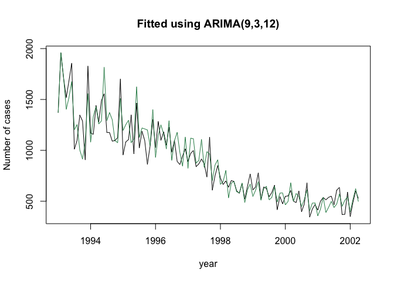

``` r
# compare the forecasted values with the 5 values that we removed 

AIDS <- read.csv("AIDS.csv", header= TRUE,sep=",")
AIDS_ts_orig<-ts(AIDS$Cases, start=c(1993,1), freq=12) # original data

plot(fcast1_AIDS, xlab = "year", ylab="Number of cases")
lines(AIDS_ts_orig)
```

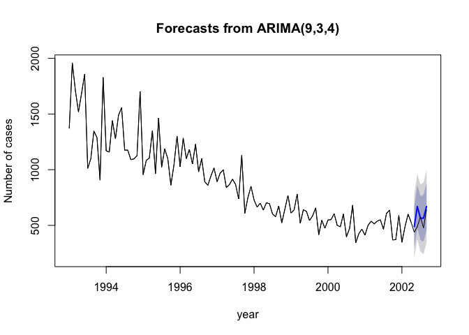

``` r
plot(fcast2_AIDS, xlab = "year", ylab="Number of cases") # this one seems to do better overall
lines(AIDS_ts_orig)
```

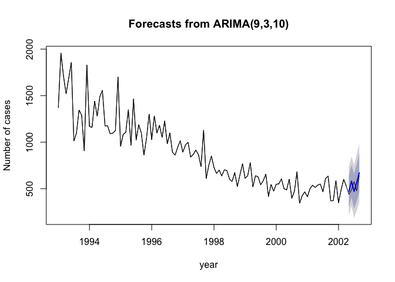

``` r
plot(fcast3_AIDS, xlab = "year", ylab="Number of cases")
lines(AIDS_ts_orig)
```

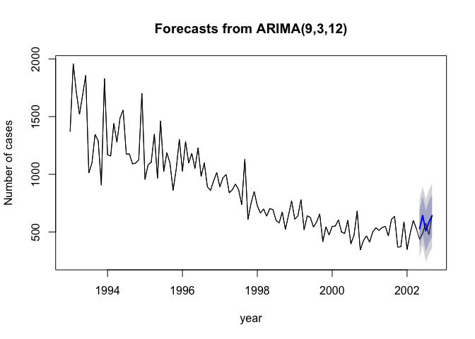
